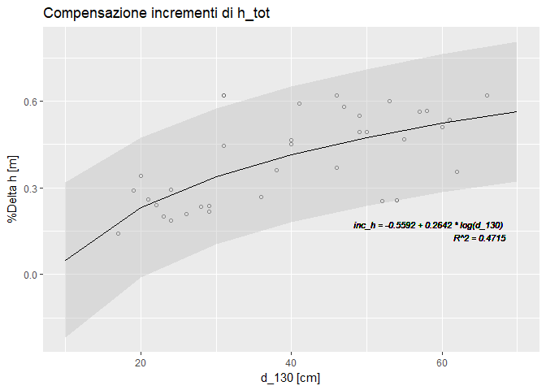

Auxometria
================
Scotti Roberto

Premessa
========

Esercizio svolto come esempio didattico di gestione di rilevi, elaborazione di dati e produzione di risultati documentati. Esercizio svolto utilizzando l'approccio 'tidy' (ordinato) proposto con 'tidyverse' \[<http://adv-r.had.co.nz/Computing-on-the-language.html> Recently, since dplyr &lt;= 0.6.0 a new way of dealing with NSE was introduced, called tidyeval\] Programma (e documento) sono disponibili su GitHub. Clonare (o fork-are) <https://github.com/nuoroforestryschool/AUXOMETRIA> Salvare eventuali modifiche al programma (che include il testo) e proporre l'integrazione (richiedere merge)

Introduzione
============

Il procedimento di stima tramite 'formula generale' è basato sul rilievo di incrementi di diametro e di altezza su molti 'alberi modello'. Gli incrementi compensati vengono utilizzati per stimare il saggio di incremento di volume tramite la seguente approssimazione:
$$
\\frac {\\Delta V}  V \\;=\\enspace 2 \\; \\frac {\\Delta d130} {d130} + \\frac {\\Delta htot} {htot}
$$

    ## Warning: package 'tidyverse' was built under R version 3.3.3

    ## Loading tidyverse: ggplot2
    ## Loading tidyverse: tibble
    ## Loading tidyverse: tidyr
    ## Loading tidyverse: readr
    ## Loading tidyverse: purrr
    ## Loading tidyverse: dplyr

    ## Warning: package 'ggplot2' was built under R version 3.3.3

    ## Conflicts with tidy packages ----------------------------------------------

    ## filter(): dplyr, stats
    ## lag():    dplyr, stats

Acesso ai rilievi e controllo di congruenza della base dati
===========================================================

``` r
library(googlesheets)
suppressMessages(library(dplyr))
gsn <- "Particella Podernovo piante crescita ORIGINALE"
# gs_ls(gsn) # useful the first time to recover the key key:
# '1J1InF1CwalFzOVyngKfBque8L3SZ8TTz-WDW49gjoLs'
gsurl <- "https://docs.google.com/spreadsheets/d/1J1InF1CwalFzOVyngKfBque8L3SZ8TTz-WDW49gjoLs"
DB0 <- gs_url(gsurl)
```

    ## Sheet-identifying info appears to be a browser URL.
    ## googlesheets will attempt to extract sheet key from the URL.

    ## Putative key: 1J1InF1CwalFzOVyngKfBque8L3SZ8TTz-WDW49gjoLs

    ## Auto-refreshing stale OAuth token.

    ## HTTP error 500 on attempt 1 ...
    ##    backing off 0.72 seconds, retrying

    ## Sheet successfully identified: "Particella Podernovo piante crescita ORIGINALE"

``` r
tabs <- tribble(~ord, ~ws_name, ~tibble, ~p_key, ~e_key, ~in_tab, 0, "CoefficientiDiRiduzione", 
    "CoefficientiDiRiduzione", NA, NA, NA, 1, "Complesso", "Complesso", NA, 
    NA, NA, 2, "PiedilistaCavallettamento", "PiedilistaCavallettamento", NA, 
    NA, NA, 3, "AlberiModello", "AlberiModello", "id_am", NA, NA, 4, "IncrementiRaggio", 
    "IncrementiRaggio", "id_am", "id_am", "AlberiModello", 5, "IncrementiAltezza", 
    "IncrementiAltezza", "id_am", "id_am", "AlberiModello")
## Acquisizione tabelle da GoogleSheet
for (i in 1:nrow(tabs)) {
    assign(tabs$tibble[i], gs_read(DB0, tabs$ws_name[i], verbose = F))
    Sys.sleep(2)
}
```

    ## No encoding supplied: defaulting to UTF-8.

    ## No encoding supplied: defaulting to UTF-8.
    ## No encoding supplied: defaulting to UTF-8.

    ## Warning: Missing column names filled in: 'X4' [4]

    ## No encoding supplied: defaulting to UTF-8.
    ## No encoding supplied: defaulting to UTF-8.
    ## No encoding supplied: defaulting to UTF-8.

``` r
## Controllo chiavi In condizioni di applicazione operativa è opportuno
## passare attraverso un sistema di gestione di basi di dati (ad es. SQLite)
## per consolidare preventivamente questi controlli.  In questo esempio
## semplificato è presente una sola Area di Saggio Il controllo sulle
## 'chiavi' delle tabelle riguarda semplicemente l'identificativo del fusto
## 'id_am', che è chiave primaria per 'AlberiModello' ed è anche chiave
## esterna per le tabelle degli incrementi.  Controllo chiavi primarie
chk_key_is_unique <- function(t) {
    t <- unlist(t)
    length(t) == length(unique(t))
}
# AlberiModello$id_am[1] <- AlberiModello$id_am[2] # for testing purposes
for (i in which(!is.na(tabs$p_key))) {
    key <- unlist(get(tabs$tibble[i])[, tabs$p_key[i]])
    if (!length(key) == length(unique(key))) 
        stop(paste("\"", tabs$p_key[i], "\"", "not unique in", "\"", tabs$tibble[i]), 
            "\"")
}
## Controllo chiavi esterne IncrementiAltezza$id_am[1] <- 99 # for testin
## purposes
for (i in which(!is.na(tabs$e_key))) {
    key <- unlist(get(tabs$tibble[i])[, tabs$e_key[i]])
    ref <- unlist(get(tabs$in_tab[i])[, tabs$e_key[i]])
    if (!length(key) == length(intersect(key, ref))) 
        stop(paste("\"", tabs$e_key[i], "\"", "not mapped out of", "\"", tabs$tibble[i]), 
            "\"")
}
```

Calcolo incremento di volume
============================

``` r
source("F_regr.plot.R")
k_ha <- 1/Complesso$sup_ads_ha
# coefficiente di espansione della superficie di rilevo all'ettaro
d_130_lbl <- "d_130 [cm]"
h_tot_lbl <- "altezza [m]"
inc_d_lbl <- "%Delta d [cm]"
inc_h_lbl <- "%Delta h [m]"

# Classi diametriche e distribuzione frequenze
acld <- 5
Tavola <- PiedilistaCavallettamento %>% fill(specie) %>% mutate(cld = round(PiedilistaCavallettamento$d_130/acld) * 
    acld) %>% group_by(specie, cld) %>% summarise(freq = sum(frequenza, na.rm = T)) %>% 
    mutate(freq_ha = freq * k_ha) %>% rename(d_130 = cld)

# Curva ipsometrica Rinaldini: =13.625*LN(A3)-16.875
summary(ci <- lm(h_tot ~ log(d_130), AlberiModello))
plot(regr.plot(df = AlberiModello, fit = ci, xvar = "d_130", xpred = Tavola$d_130, 
    xlbl = d_130_lbl, ylbl = h_tot_lbl, tit = "Curva ipsometrica"))
```

    ## Warning: Removed 10 rows containing missing values (geom_point).


``` r
Tavola <- Tavola %>% mutate(altezza = predict(ci, Tavola))

# Volume
Tavola <- Tavola %>% left_join(select(CoefficientiDiRiduzione, D, F), by = c(d_130 = "D")) %>% 
    mutate(vol_unit = F * altezza * d_130^2 * pi/40000, vol_classe = vol_unit * 
        freq_ha)

# Incrementi di diametro
irc <- "inc_r_"
IncRaggio <- IncrementiRaggio %>% gather(starts_with(irc), key = "year0", value = "inc_r") %>% 
    mutate(year = as.numeric(substr(year0, nchar(irc) + 1, nchar(year0)))) %>% 
    select(id_am, year, inc_r)
IncDiam <- IncRaggio %>% group_by(id_am) %>% summarise(inc_d = mean(inc_r) * 
    2/1000) %>% left_join(select(AlberiModello, id_am, d_130), by = "id_am")
summary(cid <- lm(inc_d ~ d_130, IncDiam))
# Rinaldini: =0.0165*(A3)-0.2202
print(regr.plot(df = IncDiam, fit = cid, tit = "Compensazione incrementi di d_130", 
    xlbl = d_130_lbl, ylbl = inc_d_lbl))
```


``` r
Tavola <- Tavola %>% mutate(inc_d = predict(cid, Tavola))

# Incremento di altezza
ihc <- "inc_h_"
IncAltezza <- IncrementiAltezza %>% gather(starts_with(ihc), key = "year0", 
    value = "inc_h") %>% mutate(year = as.numeric(substr(year0, nchar(ihc) + 
    1, nchar(year0)))) %>% select(id_am, year, inc_h)
IncAltezza_sintesi <- IncAltezza %>% group_by(id_am) %>% summarise(inc_h = mean(inc_h)/100) %>% 
    left_join(select(AlberiModello, id_am, d_130), by = "id_am")
summary(cih <- lm(inc_h ~ log(d_130), IncAltezza_sintesi))
# Rinaldini: =(0.2642*LN(A3)-0.5592)
print(regr.plot(df = IncAltezza_sintesi, fit = cih, xvar = "d_130", tit = "Compensazione incrementi di h_tot", 
    xlbl = d_130_lbl, ylbl = inc_h_lbl))
```



``` r
Tavola <- Tavola %>% mutate(inc_h = predict(cih, Tavola))

# Incremento di volume
Tavola <- Tavola %>% mutate(inc_V = vol_classe * (2 * inc_d/d_130 + inc_h/altezza))

Tavola %>% ungroup() %>% select(-specie, -freq) %>% knitr::kable(digits = 3)
```

    ## 
    ## Call:
    ## lm(formula = h_tot ~ log(d_130), data = AlberiModello)
    ## 
    ## Residuals:
    ##      Min       1Q   Median       3Q      Max 
    ## -19.8612  -1.8117   0.4904   2.4252  13.2066 
    ## 
    ## Coefficients:
    ##             Estimate Std. Error t value Pr(>|t|)    
    ## (Intercept)  -16.875      8.621  -1.957   0.0586 .  
    ## log(d_130)    13.625      2.362   5.768 1.73e-06 ***
    ## ---
    ## Signif. codes:  0 '***' 0.001 '**' 0.01 '*' 0.05 '.' 0.1 ' ' 1
    ## 
    ## Residual standard error: 5.572 on 34 degrees of freedom
    ##   (10 observations deleted due to missingness)
    ## Multiple R-squared:  0.4946, Adjusted R-squared:  0.4797 
    ## F-statistic: 33.27 on 1 and 34 DF,  p-value: 1.725e-06
    ## 
    ## 
    ## Call:
    ## lm(formula = inc_d ~ d_130, data = IncDiam)
    ## 
    ## Residuals:
    ##      Min       1Q   Median       3Q      Max 
    ## -0.31701 -0.10734  0.01844  0.08592  0.32000 
    ## 
    ## Coefficients:
    ##             Estimate Std. Error t value Pr(>|t|)    
    ## (Intercept) -0.22023    0.07295  -3.019  0.00421 ** 
    ## d_130        0.01653    0.00174   9.497  3.2e-12 ***
    ## ---
    ## Signif. codes:  0 '***' 0.001 '**' 0.01 '*' 0.05 '.' 0.1 ' ' 1
    ## 
    ## Residual standard error: 0.1592 on 44 degrees of freedom
    ## Multiple R-squared:  0.6721, Adjusted R-squared:  0.6647 
    ## F-statistic:  90.2 on 1 and 44 DF,  p-value: 3.201e-12
    ## 
    ## 
    ## Call:
    ## lm(formula = inc_h ~ log(d_130), data = IncAltezza_sintesi)
    ## 
    ## Residuals:
    ##      Min       1Q   Median       3Q      Max 
    ## -0.23857 -0.08465  0.01291  0.07189  0.27203 
    ## 
    ## Coefficients:
    ##             Estimate Std. Error t value Pr(>|t|)    
    ## (Intercept) -0.55915    0.17720  -3.155  0.00341 ** 
    ## log(d_130)   0.26416    0.04868   5.426 5.24e-06 ***
    ## ---
    ## Signif. codes:  0 '***' 0.001 '**' 0.01 '*' 0.05 '.' 0.1 ' ' 1
    ## 
    ## Residual standard error: 0.1136 on 33 degrees of freedom
    ## Multiple R-squared:  0.4715, Adjusted R-squared:  0.4555 
    ## F-statistic: 29.44 on 1 and 33 DF,  p-value: 5.241e-06

|  d\_130|  freq\_ha|  altezza|      F|  vol\_unit|  vol\_classe|  inc\_d|  inc\_h|  inc\_V|
|-------:|---------:|--------:|------:|----------:|------------:|-------:|-------:|-------:|
|      15|     4.167|   20.023|  0.603|      0.213|        0.889|   0.028|   0.156|   0.010|
|      20|    33.333|   23.942|  0.528|      0.398|       13.250|   0.110|   0.232|   0.275|
|      25|    20.833|   26.983|  0.492|      0.652|       13.586|   0.193|   0.291|   0.356|
|      30|    20.833|   29.467|  0.468|      0.974|       20.287|   0.276|   0.339|   0.606|
|      35|    29.167|   31.567|  0.448|      1.361|       39.709|   0.358|   0.380|   1.291|
|      40|    66.667|   33.386|  0.433|      1.815|      121.010|   0.441|   0.415|   4.172|
|      45|    50.000|   34.991|  0.420|      2.338|      116.883|   0.523|   0.446|   4.210|
|      50|    79.167|   36.427|  0.410|      2.932|      232.138|   0.606|   0.474|   8.650|
|      55|    20.833|   37.725|  0.402|      3.605|       75.111|   0.689|   0.499|   2.875|
|      60|    16.667|   38.911|  0.397|      4.363|       72.721|   0.771|   0.522|   2.846|
|      65|     4.167|   40.002|  0.393|      5.216|       21.735|   0.854|   0.544|   0.866|

Conclusione
===========

Si stimano:
\* 727.3 *m<sup>2</sup> ha<sup>-1</sup>* di **massa in piedi**
\* 26.16 *m<sup>2</sup> ha<sup>-1</sup> anno<sup>-1</sup>* di **incremento di volume**
